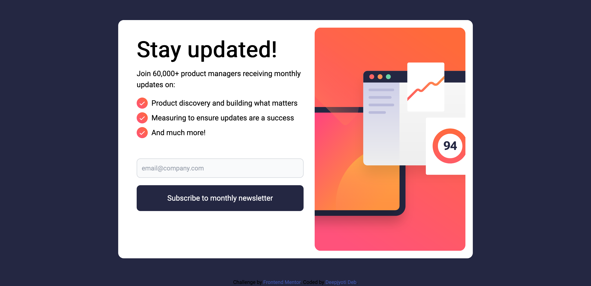
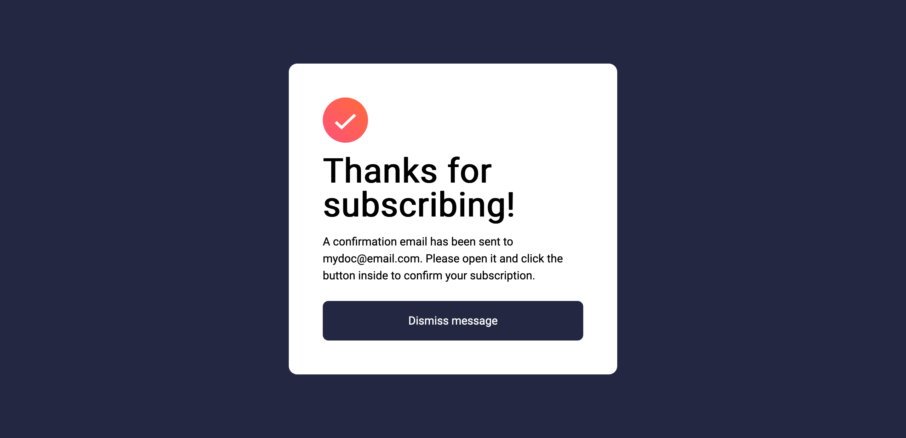

# Frontend Mentor - Newsletter sign-up form with success message solution

This is a solution to the [Newsletter sign-up form with success message challenge on Frontend Mentor](https://www.frontendmentor.io/challenges/newsletter-signup-form-with-success-message-3FC1AZbNrv). Frontend Mentor challenges help you improve your coding skills by building realistic projects.

## Table of contents

- [Frontend Mentor - Newsletter sign-up form with success message solution](#frontend-mentor---newsletter-sign-up-form-with-success-message-solution)
  - [Table of contents](#table-of-contents)
  - [Overview](#overview)
    - [The challenge](#the-challenge)
    - [Screenshots](#screenshots)
    - [Links](#links)
  - [My process](#my-process)
    - [Built with](#built-with)
    - [What I learned](#what-i-learned)
    - [Continued development](#continued-development)
    - [Useful resources](#useful-resources)
  - [Author](#author)

## Overview

### The challenge

Users should be able to:

- Add their email and submit the form
- See a success message with their email after successfully submitting the form
- See form validation messages if:
  - The field is left empty
  - The email address is not formatted correctly
- View the optimal layout for the interface depending on their device's screen size
- See hover and focus states for all interactive elements on the page

### Screenshots

### Links

- Solution URL: [Add solution URL here](https://your-solution-url.com)
- Live Site URL: [Add live site URL here](https://your-live-site-url.com)

## My process

### Built with

- HTML5
- JavaScript
- TailwindCSS

### What I learned

Good practice for creating card components using tailwind css.

### Continued development

Would like to add animations for the image on hover

### Useful resources

- [Tailwind](https://tailwindcss.com) - This helped me for understanding the css. I really liked this pattern and will use it going forward.

## Author

- Website - [SupaCode](https://supacode.vercel.app/)
- Frontend Mentor - [@DeepjyotiDeb](https://www.frontendmentor.io/profile/DeepjyotiDeb)